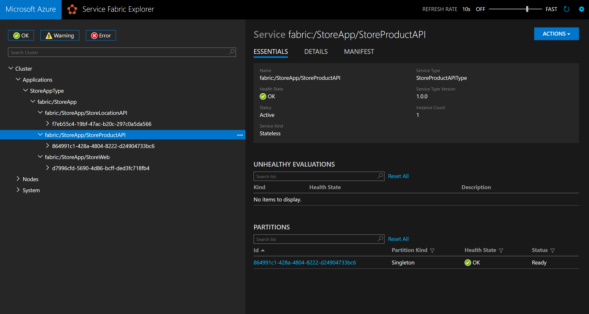
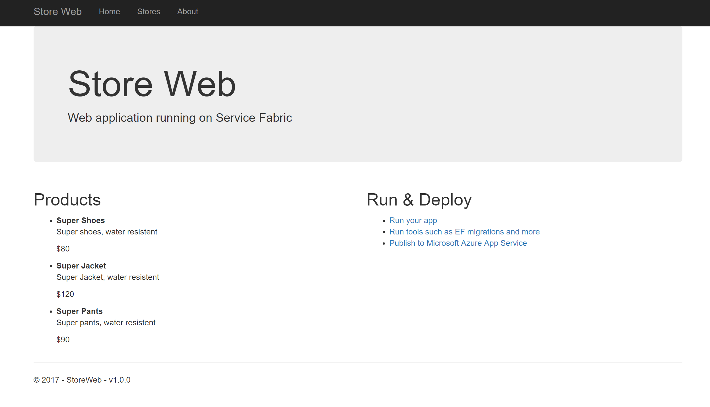
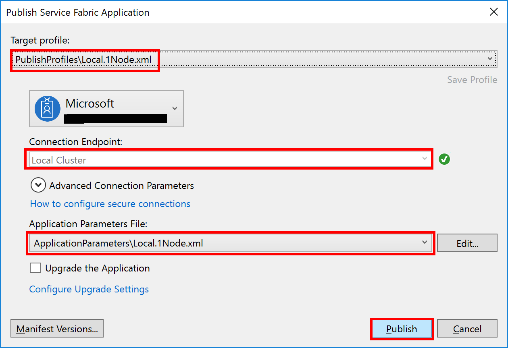
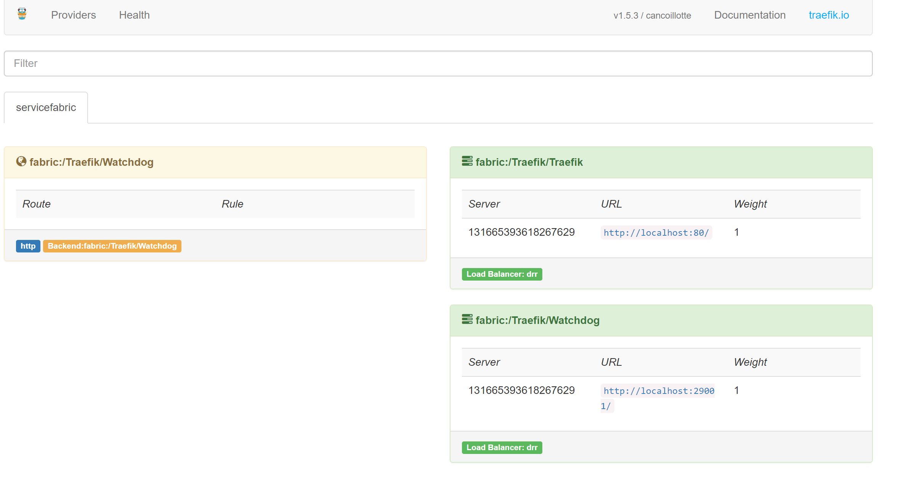
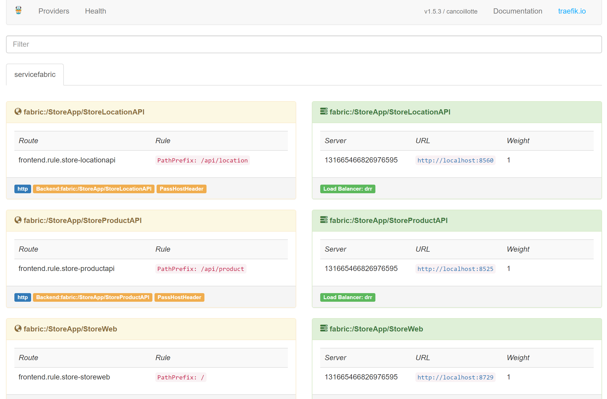
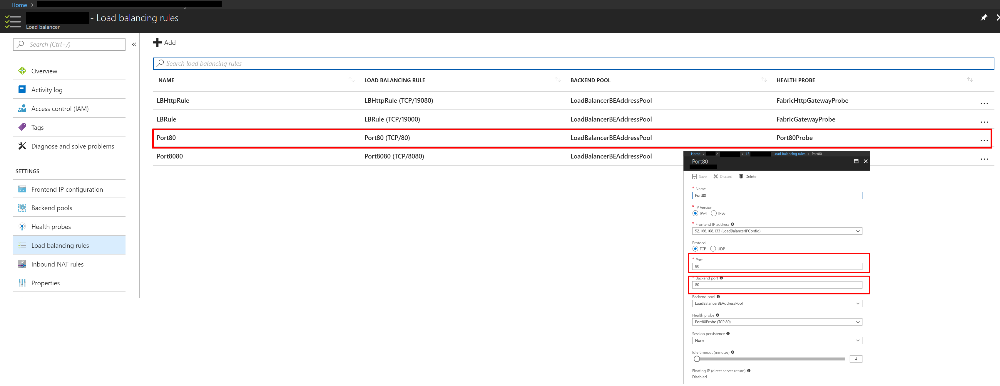
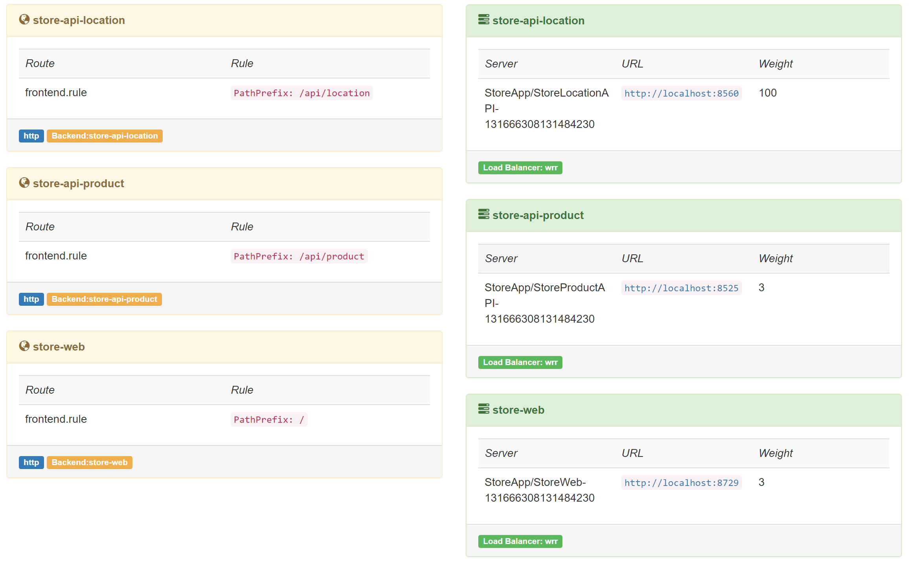
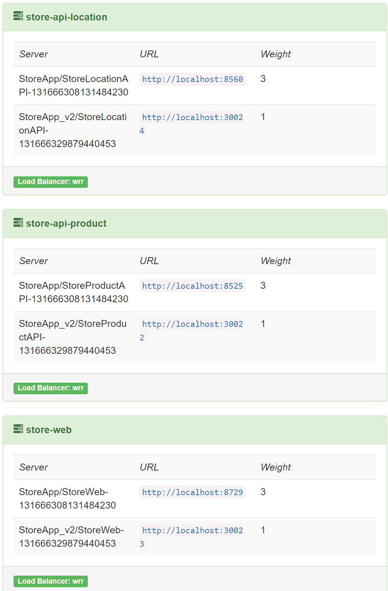
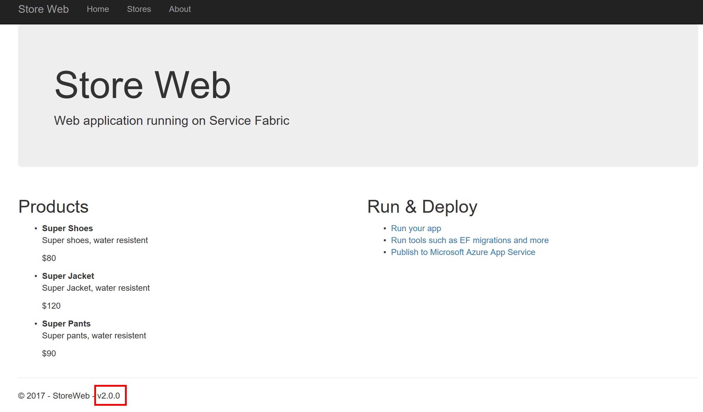

# Example

This document aims to help people without much experience in Service Fabric and/or Traefik in setting up a working solution.

The idea is to complete challenges in order to have a final solution. The challenges have been divided the following way:

1. [Adding Traefik to a Service Fabric Cluster](#challenge1)
2. [Setting up routing for 3 web applications (2 apis, 1 web) based on pathing.  /api/product => goes to product service, /api/products goes to products](#challenge2)
3. [Deploying to Azure](#challenge3)
4. [Using Traefik to handle https requests](#challenge4)
5. [Canary releases with Traefik](#challenge5)

## Prerequisites

In order to use this guide ensure the following:

- Visual Studio 2017 with Service Fabric extensions is installed

- You have a Service Fabric local cluster running

## Getting Started

In this step we will deploy a ficticious retail Store application in Service Fabric. The Store application consists of the following "microservices":

- Web site: where people can see products and store locations
- Location API: REST API providing locations of the physical stores
- Products API: REST API providing information about products on sale

To get started clone this repository and open the solution under Examples/src/StoreApp with Visual Studio. Executing the solution (F5 / Start) will deploy it to your local Service Fabric Cluster. The following 3 services should by deployed:



- Web app on http://localhost:8729/
    - List of products is displayed in start page. The list is built in server side
    
    - The Store location page (http://localhost:8729/StoreLocation) display a list of location retrieved in client side from the location API
- Products API on http://localhost:8525/api/product
- Location API on http://localhost:8560/api/location

The first challenge is to deploy Traefik Service Fabric application in our cluster.

## <a name="challenge1">Challenge 1: Deploying Traefik on a Service Fabric cluster</a>

Traefik extensions for Service Fabric was released in Traefik version 1.5. Traefik is a standalone application written in Go. Service Fabric can deploy guest applications, which are executable files. This is how Traefik is deployed to a Service Fabric cluster.

Getting Traefik running in your local cluster:

1. Clone the repository https://github.com/jjcollinge/traefik-on-service-fabric.

2. Open and Build the solution Traefik.sln

3. Right click on the project Traefik and select "Publish...". Select the local cluster as target


4. Once deployment is done you should be able to open an empty Traefik dasbhoard on http://locahost:8080.
If you have Traefik deployment errors make sure you don't  have a different application listening on port 80 (default IIS installation does that) or 8080.


## <a name="challenge2">Challenge 2: Using Traeffik to route URLs in our cluster</a>

The Store App services deployed in our local cluster have different port bindings (i.e. location api in port 8560). We want to make them more accessible outside the cluster, following these principles:

- All services should be available outside the cluster in port 80 (default http port).
- APIs should be exposed with the URL pattern http://{domain-name}/api/{resource}
- Web Site should be exposed to all other URLs on http://{domain-name}

Note: In the local cluster the domain name will be localhost. When deploying to Azure (or another cloud provider) you can apply your own CNAME rule to customize it.

Traefik routing rules in Service Fabric are resolved from Service manifests extensions configuration (with prefix "traefik."). In order to customize the routing we need to modify the ServiceManifest.xml files of our previously deployed Store app. For a list of all possible extension values check the [documentation](https://master--traefik-docs.netlify.com/configuration/backends/servicefabric/#available-labels)

Preparing services for Traefik routing:

1. Set Product API route to be /api/product by editing the ServiceManifest.xml file. To do so add an extension to the service definition to tell Traefik that all requests to /api/product should be binded to this service
    ```xml
    <StatelessServiceType ServiceTypeName="StoreProductAPIType">
      <Extensions>
        <Extension Name="Traefik">
          <Labels xmlns="http://schemas.microsoft.com/2015/03/fabact-no-schema">
            <Label Key="traefik.frontend.rule.store-productapi">PathPrefix: /api/product</Label>
            <Label Key="traefik.expose">true</Label>
            <Label Key="traefik.frontend.passHostHeader">true</Label>
          </Labels>
        </Extension>
      </Extensions>
      </StatelessServiceType>
    ```

2. Since the API will be available on {domain}/api/product we don't need CORS (XMLHttpRequest will be in same domain). Remove CORS support by editing the Startup.cs file and commenting/removing the code that enables it.
```c#
public class Startup
{
    public void ConfigureServices(IServiceCollection services)
    {
        //services.AddCors(options =>
        //{
        //    options.AddPolicy("AllowAnyOrigin", builder => builder.AllowAnyOrigin());
        //});
        services.AddMvc();
    }

    // This method gets called by the runtime. Use this method to configure the HTTP request pipeline.
    public void Configure(IApplicationBuilder app, IHostingEnvironment env)
    {
        if (env.IsDevelopment())
        {
            app.UseDeveloperExceptionPage();
        }

        //app.UseCors("AllowAnyOrigin");
        app.UseMvc();
    }
}
```

3. Set Location API route to be /api/location by editing the ServiceManifest.xml file. To do so add an extension to the service definition to tell Traefik that all requests to /api/location should be binded to this service
    ```xml
    <StatelessServiceType ServiceTypeName="StoreLocationAPIType">
      <Extensions>
        <Extension Name="Traefik">
          <Labels xmlns="http://schemas.microsoft.com/2015/03/fabact-no-schema">
            <Label Key="traefik.frontend.rule.store-locationapi">PathPrefix: /api/location</Label>
            <Label Key="traefik.expose">true</Label>
            <Label Key="traefik.frontend.passHostHeader">true</Label>
          </Labels>
        </Extension>
      </Extensions>
    </StatelessServiceType>
    ```
4. Since the API will be available on {domain}/api/location we don't need CORS (XMLHttpRequest will be in same domain). Do same as product api, removing CORS support in the Startup.cs file.

5. Set Web App route to match all remaining requests by editing the ServiceManifest.xml file. To do so add an extension to the service definition to tell Traefik that all requests prefixed with / should be binded to this service
    ```xml
    <StatelessServiceType ServiceTypeName="StoreWebType">
      <Extensions>
        <Extension Name="Traefik">
          <Labels xmlns="http://schemas.microsoft.com/2015/03/fabact-no-schema">
            <Label Key="traefik.frontend.rule.store-storeweb">PathPrefix: /</Label>
            <Label Key="traefik.expose">true</Label>
            <Label Key="traefik.frontend.passHostHeader">true</Label>
          </Labels>
        </Extension>
      </Extensions>
    </StatelessServiceType>
    ```
6. Since the location API will be available under {domain}/api/location change the way the StoreLocation page retrieves the location list (previously using the internal Service Fabric port).
```c#
namespace StoreWeb.Pages
{
    public class StoreLocationModel : PageModel
    {
        private readonly FabricClient fabricClient;
        private readonly StatelessServiceContext serviceContext;

        public StoreLocationModel(FabricClient fabricClient, StatelessServiceContext serviceContext)
        {
            this.fabricClient = fabricClient;
            this.serviceContext = serviceContext;
        }

        public string Message { get; set; }

        public string APIUrl { get; set; }

        public void OnGet()
        {
            Message = "Where our stores are located";
            // Replace the service fabric URL resolution by "/api/location"
            this.APIUrl = $"/api/location";
        }
    }
}
```

6. Run locally and test it

### Verifying the deployment

1. Notice that the new routes will be displayed in the Traefik Dashboard (http://localhost:8080).



2. Going to http://localhost will display the main page. Internal server-server communication does not need to rely on Traefik, therefore Index.cshtml.cs does not need any change (server communication still relies in Service Fabric)

3. Going to http://localhost/StoreLocation will display the Store locations page, pulling data from /api/location instead of Service Fabric internal URL. Browser communications now rely on Traefik routing (even though http://localhost:8560/api/location still works locally)

If openning http://localhost displays a different page or you have Traefik deployment errors make sure you don't have an application already listening on port 80 (default IIS installation does that) and 8080.

### Routing used in this example

As metioned before, Service Fabric Traeffik extension will use the routes defined in the service manifest extension to identify which routes should be mapped to the specific service. In our case we defined that:

- if the url starts with "api/location" (after the dns) the request should be binded to the location api
- if the url starts with "api/product" the request should be binded to the product api
- all remaining requests should be binded to the web app

Routing rules are resolved [in descending order by rule length](https://docs.traefik.io/basics/#priorities). In our case:

1. "PathPrefix: /api/location", Length 25
1. "PathPrefix: /api/product", Length 24
1. "PathPrefix: /", Length 13

**Important**: Respect the ' ' (space) between the routing rule type and the value.

Route rules can be combined with a semi-colon. Here are a few examples:

| Description | URL | Resolved Service | Route Rule |
|--|--|--|--|
| Match all | //{domain}/x/y/z <br> www.example.com/x/y/z | {service url:port}/x/y/z <br> {service url:port}/x/y/z | PathPrefix: / |
| Using a virtual path | //{domain}/virtualpath/x/y/z<br> www.example.com/virtualpath/details | {service url:port}/x/y/z <br>{service url:port}/details | PathPrefix: /virtualpath/;ReplacePathRegex: /virtualpath/(.*) /$1  |
| Using domain names | //api.{domain}/location <br> api.example.com/location | {service url:port}/api/location <br> {service url:port}/api/location | Host: xxx.domain.com;AddPrefix: /api |

For more possibilities check the [Traefik documentation](https://docs.traefik.io/basics/).

A working example of the solution can be found on this repository under Examples\src\challenges\2\StoreApp in case you have problems making it work.

## <a name="challenge3">Challenge 3: Deploying to Azure</a>

Deploying Traefik in Azure Service Fabric requires an additional step. We need to configure Traefik with the cluster certificate in order for it to be to call the Service Fabric Management API. Currently this is only possible using a PEM formatted certificate.

Assuming that a Service Fabric cluster has been created in Azure using a certificate stored in Azure Vault, those would be the steps necessary to install Traefik on the cluster:

1. Download the certificate from your Azure Vault using the Powershell script GetVaultCertificate.ps1. It will install the certificate locally (so you can access your cluster in Azure from the browser, write the .pfx certificate at the Desktop folder and write the password to console)
```powershell
$VaultName = "<vault name>"
$CertificateName = "<vault certificate name>"
$SubscriptionId = "<your subscription id>"

# Login
Login-AzureRmAccount 

Set-AzureRmContext -SubscriptionId $SubscriptionId

#get Secret object (Containing private key) from Key Vault
$AzureKeyVaultSecret=Get-AzureKeyVaultSecret -VaultName $VaultName -Name $CertificateName

#Convert private cert to bytes
$PrivateCertKVBytes = [System.Convert]::FromBase64String($AzureKeyVaultSecret.SecretValueText)

#Convert Bytes to Certificate (flagged as exportable & retaining private key)
#possible flags: https://msdn.microsoft.com/en-us/library/system.security.cryptography.x509certificates.x509keystorageflags(v=vs.110).aspx
$certObject = New-Object System.Security.Cryptography.X509Certificates.X509Certificate2 -argumentlist $PrivateCertKVBytes, $null, "Exportable, PersistKeySet"


#Optional: import certificate to current user Certificate store
$Certificatestore = New-Object System.Security.Cryptography.X509Certificates.X509Store -argumentlist "My","Currentuser"
$Certificatestore.open("readWrite")
$Certificatestore.Add($certObject)
$Certificatestore.Close()

#if private certificate needs to be exported, then it needs a password - create Temporary Random Password for certificate
$PasswordLength=20
$ascii = 33..126 | %{[char][byte]$_}
$CertificatePfxPassword = $(0..$passwordLength | %{$ascii | get-random}) -join ""

#Encrypt private Certificate using password (required if exporting to file or memory for use in ARM template)
$protectedCertificateBytes = $certObject.Export([System.Security.Cryptography.X509Certificates.X509ContentType]::Pkcs12,
$CertificatePfxPassword)
Write-output "Private Certificate Password: '$CertificatePfxPassword'"

#Optional: Export encrypted certificate to Base 64 String in memory (for use in ARM templates / other):
$InternetPfxCertdata = [System.Convert]::ToBase64String($protectedCertificateBytes)

#Optional: Export encrypted certificate to file on desktop:
$pfxPath = '{0}\{1}.pfx' -f [Environment]::GetFolderPath("Desktop") ,$CertificateName
[System.IO.File]::WriteAllBytes($pfxPath, $protectedCertificateBytes)
```

1. Generate key and crt files the following way using Ubuntu Bash on Windows (WSL). Tip: to have access to the C:/ drive you can type on bash "cd /mnt/c".

```bash
openssl pkcs12 -in <filename>.pfx -nocerts -nodes -out <filename>.key
Enter Import Password: <enter the pasword provided by the powershell script before>

openssl pkcs12 -in <filename>.pfx -clcerts -nokeys -out <filename>.crt
Enter Import Password: <enter the pasword provided by the powershell script before>
```
Tip: You can "Mouse Right Click" to copy the password to bash, don't need to type it ;)

2. Copy the 2 generated files (.key, .crt) to the Traefik Service Fabric project under TraefikPkg/Code/certs

3. Configure Traefik to access Service Fabric Management API through https using the certificates we generated previously by modifying the file TraefikPkg/Code/traefik.toml
```toml
################################################################
# Service Fabric provider
################################################################

# Enable Service Fabric configuration backend
[servicefabric]

# Service Fabric Management Endpoint
clustermanagementurl = "https://localhost:19080"

# Service Fabric Management Endpoint API Version
apiversion = "3.0"

# Enable TLS connection.
[serviceFabric.tls]
cert = "certs/<your-certificate-file>.crt"
key = "certs/<your-certificate-file>.key"
insecureskipverify = true
```

4. Publish the Traefik to Azure using Visual Studio (remember to choose the Cloud profile)

5. Publish the Store App to Azure using Visual Studio (remember to choose the Cloud profile)

6. Test the application by opening the browser on http://{clusterfqdn}.{region}.cloudapp.azure.com. You should see the web site running. If nothing comes up ensure that the port 80 is open on Azure Load Balancer.


## <a name="challenge4">Challenge 4: Adding HTTPS support on Traefik</a>

In a production environment it is a common scenario to expose services to the outside world using HTTPS. Traefik can be used to handle HTTPS requests.

To do so we need to change the Traefik deployment to listen on port 443. Additionally we need to add the respective TLS certificates.

1. Change Traefik service to use port **443** instead of **80** by modifying the TraefikTypeEndpoint in TraefikPkg ServiceManifest.xml file. Also change the UriScheme from **http** to **https**
```xml
<Endpoint Name="TraefikTypeEndpoint" UriScheme="https" Port="443" />
```
2. Copy the TLS certificates for SSL into folder TraefikPkg/Code/certs (pair of .crt and .key files). For testing purposes we can use the same certificate files used to connect to our cluster in Azure. In this case need to accept the browser warning about the insecure certificate.\
**Note:** Using a certificate purchased directly from Azure (signed by GoDaddy) was a bit challenging. [Read this section](#usingazurecertificate) to see the problem and how it can be solved.

3. Change Traefik endpoints to defaut to https with the tls certificates we copied in previous step
```toml
# Entrypoints to be used by frontends that do not specify any entrypoint.
# Each frontend can specify its own entrypoints.
#
# Optional
# Default: ["http"]
#
defaultEntryPoints = ["https"]

# Entrypoints definition
#
# Optional
# Default:
[entryPoints]
[entryPoints.https]
address = ":443"
  [entryPoints.https.tls]
    [[entryPoints.https.tls.certificates]]
    certFile = "certs/<your-tls-certificate>.crt"
    keyFile = "certs/<your-tls-certificate>.key"
[entryPoints.traefik]
address = ":8080"
```
4. Publish to Azure once again.
5. Configure your domain CNAME to target your cluster URL/IP.
6. The Store Web application should now be available on https://{your-domain}. If not, ensure that the port 443 is enabled in the Azure Load Balancer. In case the Service Fabric was used to test the deployment the URL to test is https://{clusterfqdn}.{region}.cloudapp.azure.com

### <a name="usingazurecertificate">Using Azure/GoDaddy SSL certificate in Traefik</a>

Extracting the CER/KEY files from a PFX as described in this documentation caused the CER file to be incomplete (the chain was missing). This [ssl validation tool](https://www.ssllabs.com/ssltest/analyze.html) degraded the SSL certificate from A to B, stating that the chain was incomplete. Note that browsers shown the SSL certificate as being valid, but Postman failed (with the **verify SSL** option **ON**).

The problem was solved by running `openssl pkcs12 -in <filename>.pfx -clcerts *-cacerts* -nokeys -out <filename>.crt`. This dumps the **CA** certificates into the CRT file too, not just the **CL(ient)** certificates. Doing this way will cause a **public key does not match private key** error in Traefik.

After further investigation, it seems that the order in which the **openssl** tool generates the CA+CL certificates is like this: ROOT CA &rarr; Intermediary CA &rarr; CL cert. This was valid for GoDaddy certificates, other CAs might have more intermediaries, or none. However, Traefik seems to expect a reverse order: CL &rarr; Intermediary CA &rarr; Root CA. Reversing the CRT file by hand worked. At the time of writing we haven’t found a way to generate the CRT file in reverse order, maybe others have already figured this out. Please let us know in case you have a better approach :)

## <a name="challenge5">Challenge 5: Canary release with Traefik</a>

Canary release is a way we can carefully release new software versions by only redirecting a small percentage of the requests to the newest version in order to minimize risks. After verifying that the newly deployed version is behaving as expected we can remove the older version and redirect all traffic to the latest version.

For this scenario we are going to support multi version deployments of the StoreApp by creating a branch v2, pumping all versions to 2.0.0 and deploying it under the name fabric/StoreApp_v2, this way version 1.0.0 will co-exist with version 2.0.0.

Before we deploy the application we need to change the Traefik extensions in each service to use backend groups. Backend groups allows a single frontend ("/", "/api/location" and "/api/product") to be served by multiple backends ( "/" => fabric:/StoreApp/StoreWeb, fabric:/StoreApp_v2/StoreWeb). We then define the distribution of each backend using a weight.

This is the step by step guide to make a canary release of the StoreApp from version 1 to version 2.

1. Open the StoreApp solution

2. Redefine the StoreWeb Traefik extensions in file ServiceManifest.xml to use the backend group "store-web"
```xml
<Extension Name="Traefik">
  <Labels xmlns="http://schemas.microsoft.com/2015/03/fabact-no-schema">
    <Label Key="traefik.backend.group.name">store-web</Label>
    <Label Key="traefik.backend.group.weight">3</Label>
    <Label Key="traefik.frontend.rule">PathPrefix: /</Label>
    <Label Key="traefik.frontend.passHostHeader">true</Label>
  </Labels>
</Extension>
```

3. Redefine the StoreLocationAPI Traefik extensions in file ServiceManifest.xml to use the backend group "store-api-location"
```xml
<Extension Name="Traefik">
  <Labels xmlns="http://schemas.microsoft.com/2015/03/fabact-no-schema">
    <Label Key="traefik.backend.group.name">store-api-location</Label>
    <Label Key="traefik.backend.group.weight">3</Label>
    <Label Key="traefik.frontend.rule">PathPrefix: /api/location</Label>
    <Label Key="traefik.frontend.passHostHeader">true</Label>
  </Labels>
</Extension>
```

4. Redefine the StoreProductAPI Traefik extensions in file ServiceManifest.xml to use the backend group "store-api-product"
```xml
<Extension Name="Traefik">
  <Labels xmlns="http://schemas.microsoft.com/2015/03/fabact-no-schema">
    <Label Key="traefik.backend.group.name">store-api-product</Label>
    <Label Key="traefik.backend.group.weight">3</Label>
    <Label Key="traefik.frontend.rule">PathPrefix: /api/product</Label>
    <Label Key="traefik.frontend.passHostHeader">true</Label>
  </Labels>
</Extension>
```

5. Publish the application to your local Service Fabric Cluster. After the deployment check that the Traefik Dashboard (http://localhost:8080) has the frontend and backend configuration as the picture below.


6. To simulate the v2 of the project make a copy of the whole solution to another folder and open it

7. We need to pump the version of all services from 1.0.0 to 2.0.0. Easiest way is to search the whole solution for 1.0.0 and manually replace by 2.0.0.

8. Change the name of how version 2 will be deployed in Service Fabric by editing the file StoreApp\ApplicationParameters\Local.1Node.xml changing the attribute name from "fabric:/StoreApp" to fabric:/StoreApp_v2. If you have a 5 node cluster the file to be edited is Local.5Node.xml.

9. To start with a 1/3 of the requests going to v2 change in all  ServiceManifest.xml files the weight (property traefik.backend.group.weight) from "3" to "1"

10. Still applying changes to the ServiceManifest.xml files remove the fix Endpoint port from the 3 services. The reason is that we will have multiple versions of the same application running simultaneously, therefore we cannot use a port that has been already allocated. Simply remove the attribute "Port" from the Endpoint
```xml
<Endpoint Protocol="http" Name="ServiceEndpoint" Type="Input" />
```

11. Publish v2 of the Application to your local cluster. After the deployment finished the Traefik dashboard should have multiple servers per backend, as the picture below:


12. Hitting http://localhost should get you roughly 2/3 of requests showing v1.0.0 and 1/3 v2.0.0 in the page footer.


By changing the weight of each service you can now control the request ratio that each version will receive. As explained in the [startup documentation](../) it is possible to change the Service Manifest properties through the API. The included file "ModifyStoreAppWeight.http" has the requests ready to change the location api and the store web weights. To use it, install/open Visual Studio Code and install the Rest Client.

A REST request in http file looks like this:
```
### Set v1 of store web to weight 0, to send most traffic to v2
PUT http://localhost:19080/Names/StoreApp/StoreWeb/$/GetProperty?api-version=6.0&IncludeValues=true HTTP/1.1
content-type: application/json

{
  "PropertyName": "traefik.backend.group.weight",
  "Value": {
    "Kind": "String",
    "Data": "0"
  },
  "CustomTypeId": "LabelType"
}
```

A working version of this challenge (including a solution for v1 and another for v2) can be found in folder Examples\src\challenges\5\ in this repository.